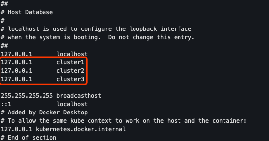

## 启动步骤

### 单机模式
- `mvn spring-boot:run -Drun.profiles=standalone`

### 多节点模式
- `mvn spring-boot:run -Drun.profiles=cluster1`
- `mvn spring-boot:run -Drun.profiles=cluster2`
- `mvn spring-boot:run -Drun.profiles=cluster3`  
or  
- `java -jar target/eureka-server-1.0.0.jar --spring.profiles.active=cluster1`
- `java -jar target/eureka-server-1.0.0.jar --spring.profiles.active=cluster2`
- `java -jar target/eureka-server-1.0.0.jar --spring.profiles.active=cluster3`

⚠️注意：
在本机运行多节点模式需要修改host  

